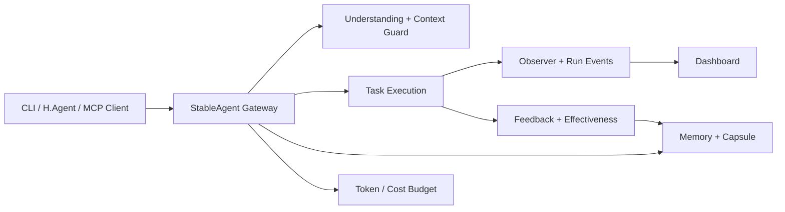
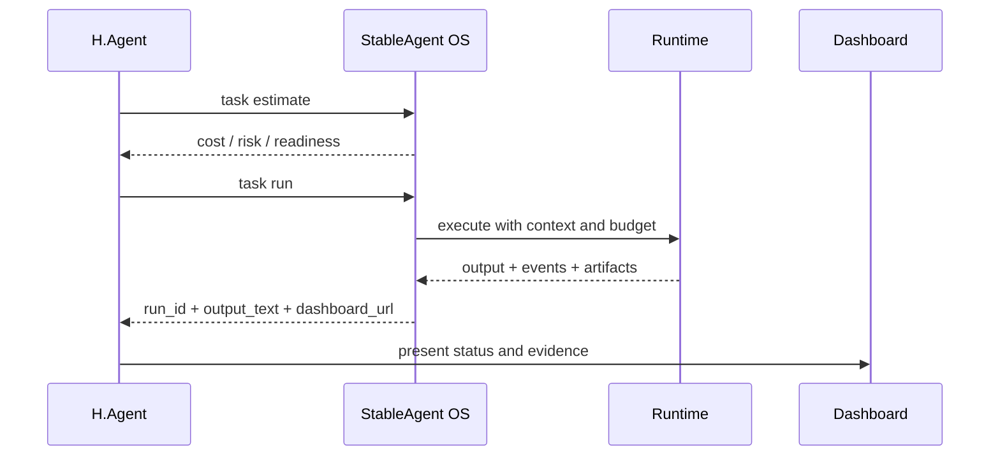
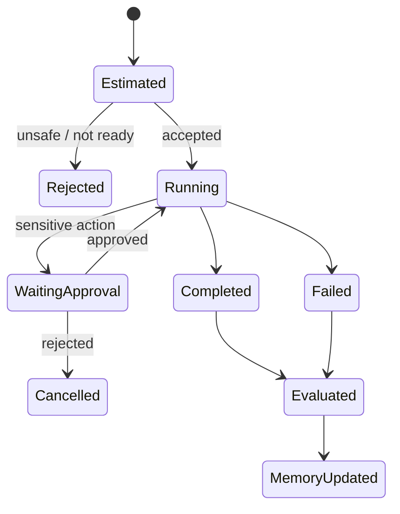
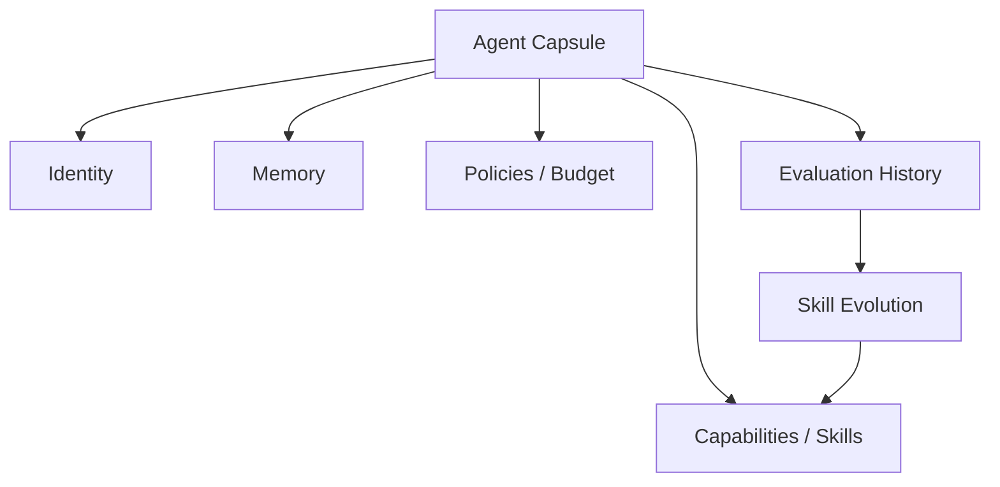
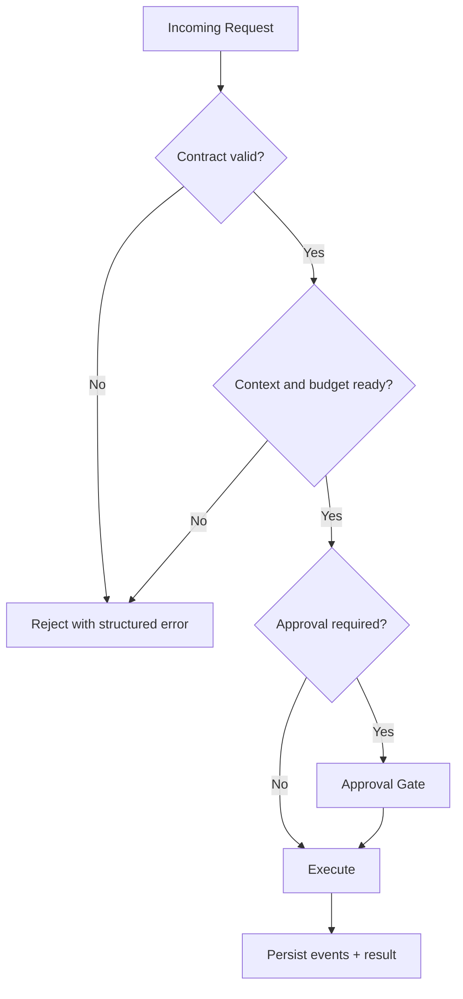

# StableAgent OS

<div align="center">

**CLI-first 的本地 Agent Runtime 与可观测执行层**

为 Agent 提供任务执行、上下文理解、记忆、预算、MCP 网关、效果评估和 Dashboard。

[](https://www.python.org/)
[](https://fastapi.tiangolo.com/)
[](https://modelcontextprotocol.io/)
[](pyproject.toml)

</div>

---

## 定位

StableAgent OS 是一个本地 Agent 运行时。它不负责替用户“聊天”，而是让上层 Agent 能够可靠地估算、执行、观察和评估任务。



## 核心能力

| 能力层 | 已实现能力 |
|---|---|
| 接入方式 | CLI、HTTP MCP、stdio MCP、H.Agent `h-agent-v1` |
| 任务执行 | estimate、run、run_id、结构化输出、运行事件 |
| 上下文 | understanding、context guard、token budget、memory |
| Agent Capsule | 持久化 Agent 身份、能力、状态与经验 |
| 可观测性 | Dashboard、observer URL、事件存储、健康检查 |
| 质量闭环 | feedback、evaluation、effectiveness、skill evolution |
| 集成诊断 | `integration doctor`、MCP health/tools 检查 |
| 安全控制 | 审批、沙箱边界、显式工具协议与错误输出 |

## 与 H.Agent 协作

StableAgent OS 是 H.Agent 的执行层。二者通过 `h-agent-v1` 契约协作，避免依赖自然语言猜测字段。



返回结果的关键字段：

```json
{
  "contract": "h-agent-v1",
  "ok": true,
  "run_id": "run_...",
  "output_text": "...",
  "dashboard_url": "http://127.0.0.1:8000/dashboard",
  "observer_url": "http://127.0.0.1:8000/observer/runs/run_..."
}
```

完整契约见 [H.Agent Integration Contract](docs/H_AGENT_INTEGRATION_CONTRACT.md)。

## 运行模式

| 模式 | 适用场景 | 启动方式 |
|---|---|---|
| 本地 CLI | 开发、脚本、单机任务 | `stableagent task run ...` |
| HTTP MCP | H.Agent、远程工具客户端、Dashboard | `stableagent serve` |
| stdio MCP | Claude Code 等 stdio 客户端 | `python -m stable_agent.mcp_stdio` |

## 快速开始

### 1. 安装

```bash
git clone https://github.com/liuanye9-lab/OS-Agent.git
cd OS-Agent

python3.11 -m venv .venv
source .venv/bin/activate
pip install -e .
```

### 2. 环境诊断

```bash
stableagent health
stableagent integration doctor --json
```

### 3. 执行任务

```bash
stableagent task estimate \
  --task-input "分析当前项目并给出风险清单" \
  --json

stableagent task run \
  --task-input "分析当前项目并给出风险清单" \
  --json
```

### 4. 启动 HTTP MCP 与 Dashboard

```bash
stableagent serve --host 127.0.0.1 --port 8000
```

启动后可检查：

```text
http://127.0.0.1:8000/mcp/health
http://127.0.0.1:8000/mcp/tools
http://127.0.0.1:8000/dashboard
```

## 任务生命周期



每次执行应至少产生：

- 唯一 `run_id`
- 结构化任务结果与错误状态
- Dashboard / observer 入口
- 可回放的运行事件
- 可用于反馈和效果评估的数据

## CLI 命令地图

```text
stableagent
├── capsule        # Agent Capsule 管理
├── memory         # 记忆管理
├── token          # Token 与预算
├── mcp            # 输出 MCP 客户端配置
├── serve          # HTTP MCP + Dashboard
├── health         # Runtime 健康检查
├── task           # estimate / run
├── feedback       # 反馈闭环
├── effectiveness  # 效果评估
├── dashboard      # Dashboard 控制
├── doctor         # 通用诊断
├── skill          # Skill 管理与演化
└── integration    # 外部集成诊断
```

使用 `--help` 查看每组命令的实时参数：

```bash
stableagent task run --help
stableagent integration --help
stableagent serve --help
```

## MCP 接入

### HTTP 模式

先启动服务：

```bash
stableagent serve --host 127.0.0.1 --port 8000
```

客户端通过 `/mcp/health` 与 `/mcp/tools` 探测当前真实能力，不应把静态工具数量当作健康状态。

### stdio 模式

通用客户端配置示例：

```json
{
  "mcpServers": {
    "stableagent": {
      "command": "/absolute/path/to/OS-Agent/.venv/bin/python",
      "args": ["-m", "stable_agent.mcp_stdio", "--profile", "minimal"],
      "cwd": "/absolute/path/to/OS-Agent"
    }
  }
}
```

Claude Code 配置见 [Claude Code MCP Setup](docs/CLAUDE_CODE_MCP_SETUP.md)。

## Agent Capsule

Capsule 将 Agent 的能力与经验从一次性进程中分离出来：



它用于保存：

- Agent 身份和运行配置
- 已知能力、Skill 与限制
- 任务经验和反馈
- 预算、策略和效果指标

## 安全与信任边界



- 集成调用使用明确契约和结构化错误。
- 高风险行为应通过审批和沙箱限制。
- 服务健康、工具列表和任务 readiness 分开诊断。
- Dashboard 是观察入口，不应被视为权限边界。
- 生产环境需要额外配置认证、TLS、密钥与数据备份。

## 项目结构

```text
stable_agent/        # 核心 Python runtime
tests/               # 单元、集成与闭环验证
docs/                # 契约、CLI、MCP 与生产接线文档
data/                # 本地运行数据，不应提交运行时数据库
pyproject.toml       # 包、版本与 CLI 入口
requirements.txt     # 运行依赖
```

## 验证状态

当前重点验证结果：

| 检查 | 状态 |
|---|---|
| H.Agent 契约、doctor 与本地任务定向测试 | 16 passed |
| `integration doctor --json` | `ok=true`，`h_agent_ready=true` |
| 真实本地 `task run` | 已验证可返回 run 与观察入口 |
| 全量测试套件 | 仍存在历史回归，尚未全绿 |

当前全量测试基线为 `1746 passed / 18 failed / 8 skipped`。失败主要位于更广的历史能力面，因此 README 不把“局部集成通过”描述成“全部生产能力通过”。

## 文档导航

| 文档 | 用途 |
|---|---|
| [Developer Quickstart](docs/DEVELOPER_QUICKSTART.md) | 开发者快速开始 |
| [CLI First Guide](docs/CLI_FIRST_GUIDE.md) | CLI 工作流 |
| [H.Agent Integration Contract](docs/H_AGENT_INTEGRATION_CONTRACT.md) | `h-agent-v1` 契约 |
| [Claude Code MCP Setup](docs/CLAUDE_CODE_MCP_SETUP.md) | stdio MCP 配置 |
| [Effectiveness Evaluation Guide](docs/EFFECTIVENESS_EVALUATION_GUIDE.md) | 效果评估 |
| [V11 Production Wiring](docs/V11_PRODUCTION_WIRING.md) | 生产接线参考 |

## 当前边界与下一阶段

- 全量历史测试仍需治理，不能只依赖定向集成测试。
- 多租户鉴权、TLS、密钥托管和生产备份不由本地开发模式自动提供。
- 工具能力以运行时 `/mcp/tools` 为准，不承诺固定数量。
- 下一阶段重点是减少历史回归、强化审批/沙箱、统一事件与效果评估闭环。
