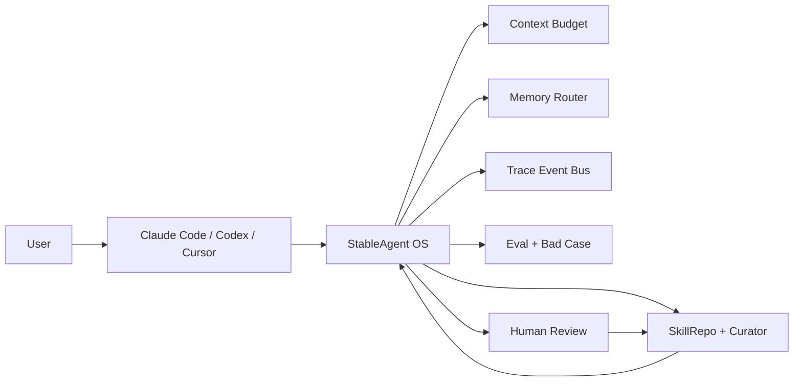
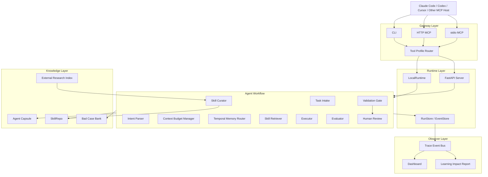
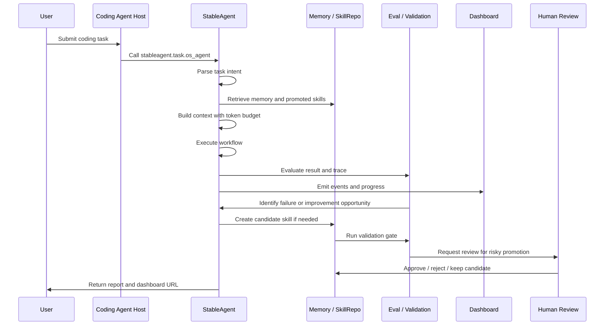
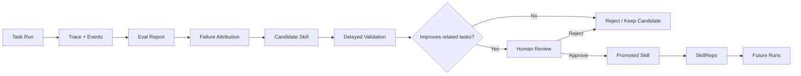
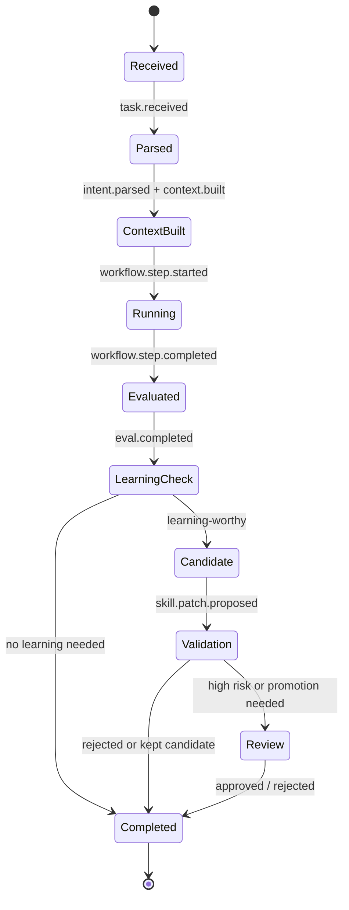
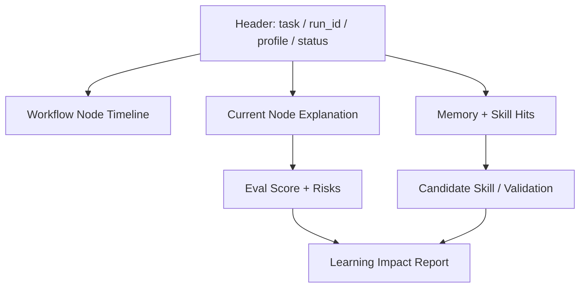
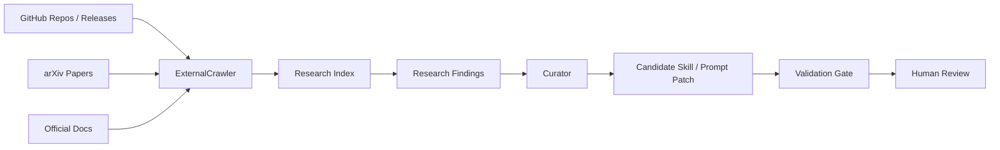
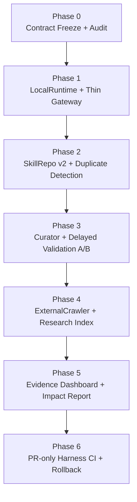

<p align="center">
  
  
  
  
  
</p>

<h1 align="center">StableAgent OS</h1>

<p align="center">
  <strong>A personal Agent harness for AI Coding workflows.</strong><br />
  <sub>Memory · Token Budget · Trace · Eval · Skill Curation · Validation Gate · Human Review</sub>
</p>

<p align="center">
  <a href="#what-is-stableagent-os">Overview</a> ·
  <a href="#quick-start">Quick Start</a> ·
  <a href="#architecture">Architecture</a> ·
  <a href="#self-evolution-loop">Self-Evolution Loop</a> ·
  <a href="#current-status">Status</a> ·
  <a href="#roadmap">Roadmap</a>
</p>

---

## What is StableAgent OS?

**StableAgent OS** is a local-first harness layer for AI Coding Agents such as Claude Code, Codex, Cursor, Trae, and other MCP-compatible tools.

It is not another chat bot, and it does not fine-tune model weights.

It sits beside your coding agent and helps it work more consistently by managing:

- user preferences and expression habits;
- project memory and context selection;
- token budget and compression guardrails;
- task traces and execution events;
- evaluation, bad cases, and regression evidence;
- candidate skill patches and validation gates;
- human review before long-term promotion.

> The core idea: every Agent run should become a traceable, reviewable, testable, and reusable learning artifact.

---

## Why this project exists

AI Coding Agents are getting stronger, but long-running real projects still expose the same recurring problems:

```text
You ask: "Only fix this small bug. Do not rewrite unrelated modules."

The Agent may still:
1. edit too many files;
2. forget your earlier constraints;
3. miss project-specific context;
4. repeat a previous mistake;
5. compress away important memory;
6. produce a confident answer without evidence;
7. make it hard to tell what it is doing now.
```

StableAgent OS tries to solve this by adding a **bounded control layer** around the Agent:



---

## Product Positioning

StableAgent OS is best understood as:

```text
AI Coding Agent
+ Personal Memory Layer
+ Workflow Observer
+ Evaluation Harness
+ Skill Curation System
+ Human Review Gate
```

It is designed for people who repeatedly use AI Coding Agents to iterate real projects and want the Agent to become more aligned with their personal workflow over time.

### What it is

| Layer | Role |
|---|---|
| Harness | Wraps Agent execution with trace, eval, memory, and safety gates |
| Capsule | Stores user preferences, project memory, bad cases, skills, and eval history |
| Observer | Shows what the Agent is doing, why, and what happened |
| Curator | Converts feedback and failures into candidate skills |
| Validation Gate | Proves whether a new skill actually improves future tasks |

### What it is not

| Not this | Why |
|---|---|
| A fine-tuned model | It does not train model weights |
| A fully autonomous self-modifying system | Human review remains required |
| A generic chatbot | It is built around coding-agent workflows |
| A dashboard-only demo | The goal is validated learning, not just visualization |
| A magic memory store | Memory must be retrieved, evaluated, and proven useful |

---

## Quick Start

### 1. Clone

```bash
git clone https://github.com/liuanye9-lab/OS-Agent.git
cd OS-Agent
```

### 2. Install

```bash
python3.11 -m venv .venv
source .venv/bin/activate
python -m pip install -U pip
python -m pip install -e .[dev]
```

If your shell does not support extras, use:

```bash
python -m pip install -e .
python -m pip install pytest pytest-asyncio ruff
```

### 3. Run local server

```bash
PYTHONPATH=. .venv/bin/python -m stable_agent.cli serve
```

Open:

```text
API Docs:    http://127.0.0.1:8000/docs
MCP:         http://127.0.0.1:8000/mcp/
Dashboard:   http://127.0.0.1:8000
Connect:     http://127.0.0.1:8000/connect
```

### 4. Run a task from CLI

```bash
PYTHONPATH=. .venv/bin/python -m stable_agent.cli task run \
  --task-input "Test StableAgent normal path: task intake, memory retrieval, context guard, eval, trace, and dashboard replay." \
  --open-dashboard \
  --json
```

### 5. Test MCP tools/list

```bash
curl -X POST http://127.0.0.1:8000/mcp/ \
  -H "Content-Type: application/json" \
  -d '{
    "jsonrpc": "2.0",
    "id": "tools-list",
    "method": "tools/list",
    "params": {}
  }'
```

---

## Claude Code / MCP Setup

StableAgent supports both HTTP MCP and stdio MCP.

### HTTP MCP

Use this when the server is already running:

```json
{
  "mcpServers": {
    "stableagent-http": {
      "type": "http",
      "url": "http://127.0.0.1:8000/mcp/",
      "timeout": 60000
    }
  }
}
```

### stdio MCP

Use this for local Claude Code integration:

```json
{
  "mcpServers": {
    "stableagent": {
      "type": "stdio",
      "command": "/ABSOLUTE_PATH/OS-Agent/.venv/bin/python",
      "args": ["-m", "stable_agent.mcp_stdio", "--profile", "minimal"],
      "env": {
        "PYTHONPATH": "/ABSOLUTE_PATH/OS-Agent",
        "STABLE_AGENT_TOOL_PROFILE": "minimal",
        "STABLE_AGENT_RUNTIME_MODE": "local"
      }
    }
  }
}
```

Detailed guide: [docs/CLAUDE_CODE_MCP_SETUP.md](docs/CLAUDE_CODE_MCP_SETUP.md)

---

## Architecture



---

## Core Workflow

Each run should follow a traceable workflow:



---

## Self-Evolution Loop

StableAgent uses a **bounded self-evolution loop**.

It does not automatically overwrite long-term skills. It should only promote a skill after evidence exists.



### Promotion rule

A candidate skill should not become a promoted skill unless it satisfies evidence gates such as:

```text
schema_valid = true
validations >= 2
score_delta >= +0.03
regression_count = 0
event_completeness = 1.0
token_delta <= +0.10
high_risk_requires_human_review = true
```

---

## Agent Capsule

The Agent Capsule is the portable personal layer around your AI Coding workflow.

```text
.stableagent-capsule/
├── profile/              # user expression habits and preferences
├── memory/               # long-term memory and project memory
├── skills/               # validated and promoted skills
├── candidates/           # candidate skills waiting for validation
├── bad_cases/            # failure cases and regression examples
├── evals/                # evaluation cases and validation records
├── token_ledger/         # token budget and compression reports
├── model_profiles/       # model-specific strengths and weaknesses
└── effectiveness/        # impact reports and A/B evidence
```

The goal is simple:

> Your AI tools may change, but your preferences, mistakes, rules, and evaluation standards should remain portable.

---

## Visual Task Lifecycle



---

## Dashboard Observer

The dashboard should help users understand the Agent instead of only showing logs.

It should answer:

```text
What is the Agent doing now?
Why did it choose this step?
Which memory or skill did it use?
How much context did it keep or drop?
Did the result pass evaluation?
Did this run create a candidate skill?
Does a human need to approve anything?
```

Recommended observer layout:



---

## External Research Harness

StableAgent is evolving toward a research-aware harness:



The system should not blindly copy external ideas into long-term memory.

External findings should first become:

- evidence;
- candidate improvement proposals;
- validation cases;
- coding prompts for PR-only implementation.

---

## Current Status

StableAgent OS is currently best described as:

```text
Feature-rich alpha
```

### Already present

- CLI / HTTP MCP / stdio MCP entry points;
- `stableagent.task.os_agent` task execution interface;
- dashboard and observer direction;
- trace events and run lifecycle concepts;
- memory, context budget, token report, feedback, eval, and skill-related modules;
- validation gate and approval specifications;
- tests covering important directions such as delayed validation, dashboard replay, approval, CLI/runtime, and no-fake-improvement constraints.

### Still not mature enough

- true user-perceived personalization is still weak;
- token saving is not yet strongly proven by before/after measurement;
- self-evolution claims still need real benchmark evidence;
- candidate skill validation needs stronger baseline-vs-candidate A/B tests;
- dashboard should show evidence and impact, not just events;
- the harness should remain PR-only and human-reviewed before promotion.

---

## Testing

Run the full test suite:

```bash
pytest -q
```

Run selected tests for the core harness direction:

```bash
pytest \
  tests/test_cli_without_http.py \
  tests/test_curator_policy.py \
  tests/test_delayed_validation.py \
  tests/test_delayed_validation_v1.py \
  tests/test_dashboard_history_replay.py \
  tests/test_learning_impact_no_fake_improvement.py \
  -q
```

Run local deployment:

```bash
chmod +x scripts/deploy_local.sh
bash scripts/deploy_local.sh
```

---

## Design Principles

### 1. Do not pretend improvement happened

If no memory was hit, no skill was used, or no validation was run, the system should say so clearly.

### 2. Candidate is not promoted

A failed run may create a candidate skill, but that skill should not become long-term behavior without validation.

### 3. Human review remains the final gate

High-risk actions, skill promotion, and codebase-level changes must stay human-reviewed.

### 4. Token savings must be measured

Token optimization should be shown with baseline-vs-actual comparison, not just claimed.

### 5. The dashboard must explain impact

The user should see what changed, what did not improve, and what needs more evidence.

---

## Roadmap



| Phase | Goal | Success Standard |
|---|---|---|
| P0 | Freeze contract and required events | golden snapshots pass |
| P1 | Make gateway thinner and runtime local-first | CLI / stdio work without HTTP dependency |
| P2 | Build real SkillRepo lifecycle | candidate / validated / promoted are separated |
| P3 | Validate skills with related-task A/B | no simulated promotion |
| P4 | Add external research ingestion | GitHub / arXiv findings become evidence, not direct skills |
| P5 | Improve dashboard evidence | user sees memory, skill, token, validation, and impact |
| P6 | Add PR-only harness CI | automation stops at ready-for-human-review |

---

## Suggested Portfolio Framing

**Project title**

```text
StableAgent OS｜A Personal Self-Evolving Harness for AI Coding Agents
```

**Short description**

```text
Built a local-first Agent harness that wraps Claude Code / Codex / Cursor with memory routing, context budgeting, trace observability, evaluation, skill curation, validation gates, and human-reviewed self-evolution.
```

**Interview angle**

```text
The project does not claim that the Agent magically becomes smarter.
It turns each Agent run into evidence: what memory was used, what context was protected, what failed, what candidate skill was proposed, and whether later validation proved it useful.
```

---

## Repository Map

```text
OS-Agent/
├── stable_agent/          # core runtime, memory, eval, skill, gateway, approval
├── web/                   # dashboard and observer UI
├── api/                   # API routes and adapters
├── skills/                # skill artifacts and best_skill export
├── experiments/           # self-iteration experiments and reports
├── tests/                 # unit, integration, dashboard, validation, approval tests
├── docs/                  # setup guides and system specifications
├── scripts/               # local deployment and helper scripts
├── requirements.txt
├── pyproject.toml
└── README.md
```

---

## Safety Boundary

StableAgent OS should evolve as a **bounded self-iteration harness**:

```text
Allowed:
- analyze traces;
- propose candidate skills;
- run validation;
- generate draft patches;
- create reports;
- ask for human approval.

Not allowed by default:
- auto-merge code;
- auto-deploy;
- overwrite best_skill.md without review;
- promote high-risk skills without approval;
- hide failed validation;
- claim learning improvement without evidence.
```

---

## License

This repository is an experimental Agent harness project. Use carefully, keep human review enabled, and treat self-evolution as an evidence-gated engineering workflow rather than an unsupervised autonomous process.
