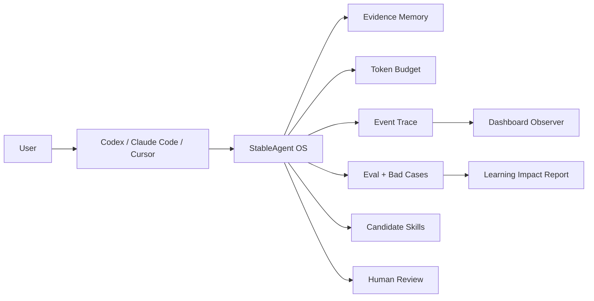
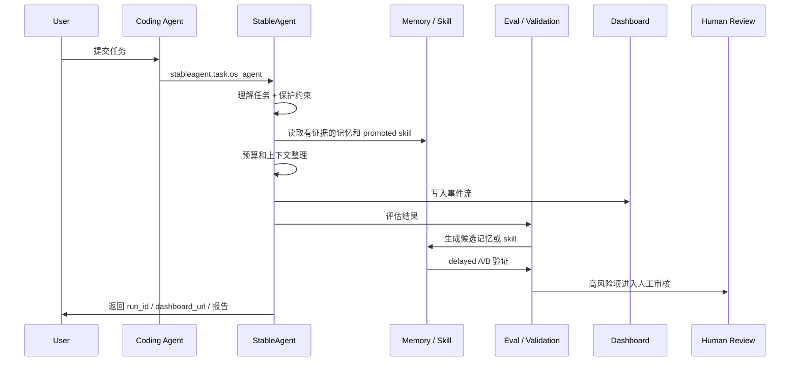
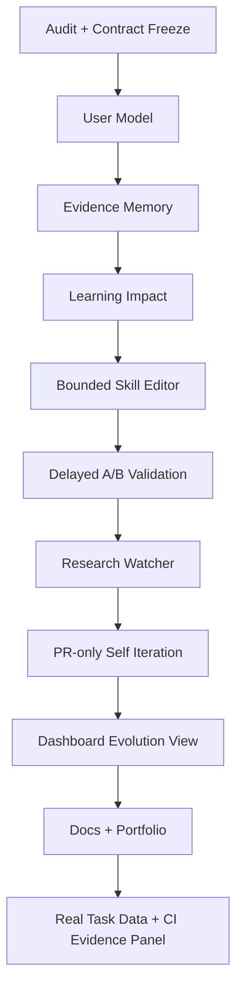

# StableAgent Recursive Harness

> 给 AI Coding Agent 配一层本地优先的控制系统：记忆、预算、轨迹、验证、Dashboard、人工审核。

StableAgent OS 不是另一个聊天机器人，也不训练模型权重。它站在 Codex、Claude Code、Cursor、Trae 等 Coding Agent 外面，负责让每次任务变成可复盘、可验证、可积累的运行记录。

## 当前版本

| 项目 | 状态 |
|---|---|
| Version | StableAgent Recursive Harness Alpha |
| Implementation | Phase 0-9 completed |
| Main branch | merged |
| Unit tests | `1803 passed, 8 skipped` |
| Integration | PASS |
| Dashboard | Observer + replay + recursive harness panels |

## 解决什么问题

AI Coding Agent 经常会：

- 忘记用户刚刚说过的限制；
- 改太多无关文件；
- 重复过去犯过的错；
- 说自己“学会了”，但没有证据；
- 任务跑完后很难复盘它到底做了什么。

StableAgent 的目标不是让模型“突然变聪明”，而是加一层可控外壳：



## 核心模块

| 模块 | 作用 | 位置 |
|---|---|---|
| User Model | 记录表达习惯、认知偏好、风险边界 | `stable_agent/user_model/` |
| Evidence Memory | 只使用有证据的记忆，并检测冲突/过期 | `stable_agent/memory_evidence/` |
| Learning Impact | 展示哪些地方真的有影响，哪些还没证据 | `stable_agent/impact/` |
| Skill Optimizer | 生成候选 skill patch，但限制删除和大改 | `stable_agent/skill_optimizer/` |
| Validation | 用 delayed A/B 决定候选是否能推广 | `stable_agent/validation/` |
| Research Watcher | 把外部资料变成 evidence card，不直接改行为 | `stable_agent/research/` |
| Self Iteration | 只生成 PR 级提案，不自动 merge / deploy | `stable_agent/self_iteration/` |
| Dashboard | 展示事件、记忆、影响、验证、审核状态 | `web/templates/run_observer.html` |

## 一次任务怎么流动



## Quick Start

```bash
python3 -m venv .venv
./.venv/bin/pip install -r requirements.txt
PYTHONPATH=. ./.venv/bin/python -m stable_agent.cli serve
```

运行任务：

```bash
PYTHONPATH=. ./.venv/bin/python -m stable_agent.cli task run \
  --task-input "Test StableAgent normal path" \
  --open-dashboard \
  --json
```

常用地址：

```text
Dashboard: http://127.0.0.1:8000
Observer:  http://127.0.0.1:8000/observe/{run_id}
MCP:       http://127.0.0.1:8000/mcp/v5/mcp
```

## MCP 接入规则

对非平凡 coding 任务，接入方应先调用：

```json
{
  "name": "stableagent.task.os_agent",
  "arguments": {
    "task_input": "任务描述",
    "open_dashboard": true
  }
}
```

必须返回：

- `run_id`
- `dashboard_url`
- `observer_url`
- `missing_required_events`
- `understanding_trace`
- `token_report`
- `expression_matches`

详细规则见 [AGENTS.md](AGENTS.md) 和 [CLAUDE.md](CLAUDE.md)。

## Dashboard

Dashboard Observer 当前展示：

- run progress；
- API history replay；
- WebSocket live status；
- task status / why / evidence / next step；
- avatar scene；
- V11 六大面板；
- Recursive Harness 九面板；
- self-improvement report；
- feedback buttons。

交互式可视化页保留在 [README_VISUAL.html](README_VISUAL.html)。

## 安全边界

默认允许：

- 分析 trace；
- 生成候选 skill；
- 生成 evidence card；
- 运行验证；
- 生成 PR 级改进方案；
- 请求人工审核。

默认禁止：

- 自动合并代码；
- 自动部署；
- 未审核覆盖 `best_skill.md`；
- 未验证推广高风险 skill；
- 隐藏失败验证；
- 没有证据就宣称学习有效。

## Roadmap



| Phase | 状态 |
|---|---|
| P0-P9 | Complete |
| Next | 积累真实任务 A/B 数据，生成真实效果报告 |

## 验证

```bash
PYTHONPATH=. ./.venv/bin/python -m pytest -q
bash scripts/integration_test.sh
PYTHONPATH=. ./.venv/bin/python tools/check_closed_loop.py --base-url http://127.0.0.1:8000
```

最近一次验证：

| Check | Result |
|---|---|
| pytest | `1803 passed, 8 skipped` |
| integration_test.sh | PASS |
| closed-loop structural checks | PASS |
| Dashboard visual QA | desktop + mobile passed |

## 仓库结构

```text
stable_agent/          core runtime, memory, eval, gateway, harness
web/                   Dashboard and Observer UI
docs/recursive_harness design docs for the Recursive Harness layer
tests/                 unit, integration, dashboard, validation tests
scripts/               local helper scripts
tools/                 closed-loop and integration check tools
```

## 作品集一句话

StableAgent OS is a local-first, evidence-gated harness that wraps AI Coding Agents with memory, observability, validation, and human-reviewed self-iteration.
