<p align="center">
  
  
  
  
  
</p>

<h1 align="center">StableAgent OS</h1>

<p align="center">
  <strong>A personal Agent harness for AI Coding workflows.</strong><br />
  <sub>Memory · Token Budget · Trace · Eval · Skill Curation · Validation Gate · Human Review</sub>
</p>

<p align="center">
  <strong>给 AI Coding Agent 配一套"外接大脑"</strong><br />
  <sub>记住你的习惯 · 防止任务跑偏 · 记录失败经验 · 可视化每一次 Agent 思考</sub>
</p>

<p align="center">
  <a href="#what-is-stableagent-os">Overview</a> ·
  <a href="#quick-start">Quick Start</a> ·
  <a href="#architecture">Architecture</a> ·
  <a href="#self-evolution-loop">Self-Evolution Loop</a> ·
  <a href="#current-status">Status</a> ·
  <a href="#roadmap">Roadmap</a> ·
  <a href="#zh-cn">中文版</a>
</p>

---

## What is StableAgent OS?

**StableAgent OS** is a local-first harness layer for AI Coding Agents such as Claude Code, Codex, Cursor, Trae, and other MCP-compatible tools.

It is not another chat bot, and it does not fine-tune model weights.

It sits beside your coding agent and helps it work more consistently by managing:

- user preferences and expression habits;
- project memory and context selection;
- token budget and compression guardrails;
- task traces and execution events;
- evaluation, bad cases, and regression evidence;
- candidate skill patches and validation gates;
- human review before long-term promotion.

> The core idea: every Agent run should become a traceable, reviewable, testable, and reusable learning artifact.

---

## StableAgent OS 是什么？

**StableAgent OS** 是一个本地优先的 Agent 控制层，适配 Claude Code、Codex、Cursor、Trae 等 MCP 兼容工具。

它不训练模型权重，也不是另一个聊天机器人。它做的是：

> 把你的表达习惯、项目上下文、失败经验、评测标准、Token 预算和 Dashboard 轨迹，打包成一套可迁移的 **Agent Capsule**，让不同 AI 工具更稳定地理解你。

可以把它想成：

| 类比 | StableAgent OS 是什么 |
|---|---|
| 学生 | 大模型本身，例如 Claude / GPT / Qwen / DeepSeek |
| 老师 | 你对模型的反馈和纠正 |
| 错题本 | Bad Case Bank，记录模型犯过的错 |
| 学习计划 | Skill Patch，把失败经验变成可复用规则 |
| 书包/U 盘 | Agent Capsule，打包你的记忆、规则、习惯和评测标准 |
| 仪表盘 | Dashboard，把 Agent 每一步理解、压缩、判断、学习过程可视化 |

---

## Why this project exists

AI Coding Agents are getting stronger, but long-running real projects still expose the same recurring problems:

```text
You ask: "Only fix this small bug. Do not rewrite unrelated modules."

The Agent may still:
1. edit too many files;
2. forget your earlier constraints;
3. miss project-specific context;
4. repeat a previous mistake;
5. compress away important memory;
6. produce a confident answer without evidence;
7. make it hard to tell what it is doing now.
```

StableAgent OS tries to solve this by adding a **bounded control layer** around the Agent:

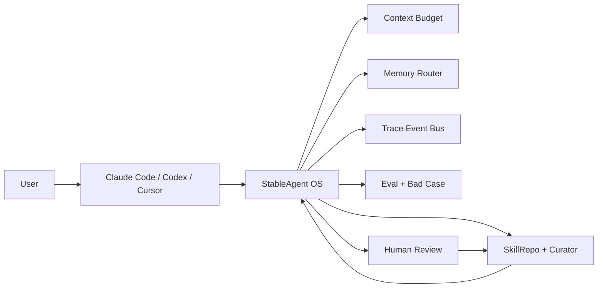

---

## 为什么需要 StableAgent OS？

AI Coding 工具越来越强，但长任务里经常出现这些问题：

```text
你说：只修这个小 bug，不要大范围重构。

AI 可能会：
1. 改了 12 个无关文件；
2. 忘了你刚刚强调的约束；
3. 生成看似正确但无法运行的代码；
4. 同一个错误下次继续犯；
5. 解释得很自信，但你不知道它到底怎么理解任务；
6. token 越堆越多，最后上下文又乱又贵。
```

StableAgent OS 想解决的是：

> **不是让模型"变聪明"，而是给模型外面装一层能记忆、能复盘、能约束、能可视化的使用层。**

---

## Product Positioning

StableAgent OS is best understood as:

```text
AI Coding Agent
+ Personal Memory Layer
+ Workflow Observer
+ Evaluation Harness
+ Skill Curation System
+ Human Review Gate
```

It is designed for people who repeatedly use AI Coding Agents to iterate real projects and want the Agent to become more aligned with their personal workflow over time.

### What it is

| Layer | Role |
|---|---|
| Harness | Wraps Agent execution with trace, eval, memory, and safety gates |
| Capsule | Stores user preferences, project memory, bad cases, skills, and eval history |
| Observer | Shows what the Agent is doing, why, and what happened |
| Curator | Converts feedback and failures into candidate skills |
| Validation Gate | Proves whether a new skill actually improves future tasks |

### What it is not

| Not this | Why |
|---|---|
| A fine-tuned model | It does not train model weights |
| A fully autonomous self-modifying system | Human review remains required |
| A generic chatbot | It is built around coding-agent workflows |
| A dashboard-only demo | The goal is validated learning, not just visualization |
| A magic memory store | Memory must be retrieved, evaluated, and proven useful |

---

## 项目定位

StableAgent OS 的核心不是一次任务，而是长期积累的 **Agent Capsule**。

它可以理解为：

```text
AI Coding Agent
+ Personal Memory Layer
+ Workflow Observer
+ Evaluation Harness
+ Skill Curation System
+ Human Review Gate
```

它可以被理解为：

| 类比 | StableAgent OS 是什么 |
|---|---|
| 学生 | 大模型本身，例如 Claude / GPT / Qwen / DeepSeek |
| 老师 | 你对模型的反馈和纠正 |
| 错题本 | Bad Case Bank，记录模型犯过的错 |
| 学习计划 | Skill Patch，把失败经验变成可复用规则 |
| 书包/U 盘 | Agent Capsule，打包你的记忆、规则、习惯和评测标准 |
| 仪表盘 | Dashboard，把 Agent 每一步理解、压缩、判断、学习过程可视化 |

---

## Quick Start

### 1. Clone

```bash
git clone https://github.com/liuanye9-lab/OS-Agent.git
cd OS-Agent
```

### 2. Install

```bash
python3.11 -m venv .venv
source .venv/bin/activate
python -m pip install -U pip
python -m pip install -e .[dev]
```

If your shell does not support extras, use:

```bash
python -m pip install -e .
python -m pip install pytest pytest-asyncio ruff
```

### 3. Run local server

```bash
PYTHONPATH=. .venv/bin/python -m stable_agent.cli serve
```

Open:

```text
API Docs:    http://127.0.0.1:8000/docs
MCP:         http://127.0.0.1:8000/mcp/
Dashboard:   http://127.0.0.1:8000
Connect:     http://127.0.0.1:8000/connect
```

### 4. Run a task from CLI

```bash
PYTHONPATH=. .venv/bin/python -m stable_agent.cli task run \
  --task-input "Test StableAgent normal path: task intake, memory retrieval, context guard, eval, trace, and dashboard replay." \
  --open-dashboard \
  --json
```

### 5. Test MCP tools/list

```bash
curl -X POST http://127.0.0.1:8000/mcp/ \
  -H "Content-Type: application/json" \
  -d '{
    "jsonrpc": "2.0",
    "id": "tools-list",
    "method": "tools/list",
    "params": {}
  }'
```

---

## 快速开始

### 1. 克隆项目

```bash
git clone https://github.com/liuanye9-lab/OS-Agent.git
cd OS-Agent
```

### 2. 使用 Python 3.11+

```bash
python3.11 -m venv .venv
source .venv/bin/activate
python -m pip install -U pip
python -m pip install -e .[dev]
```

如果 shell 不支持 extras：

```bash
python -m pip install -e .
python -m pip install pytest pytest-asyncio ruff
```

### 3. 启动服务

```bash
PYTHONPATH=. .venv/bin/python -m stable_agent.cli serve
```

启动成功后访问：

```text
API Docs:    http://127.0.0.1:8000/docs
MCP:         http://127.0.0.1:8000/mcp/
Dashboard:   http://127.0.0.1:8000
Connect:     http://127.0.0.1:8000/connect
```

### 4. 执行任务（CLI Mode）

```bash
PYTHONPATH=. .venv/bin/python -m stable_agent.cli task run \
  --task-input "继续优化这个项目，不要AI味，不要大范围重构无关文件" \
  --open-dashboard \
  --json
```

### 5. 健康检查

```bash
PYTHONPATH=. .venv/bin/python -m stable_agent.cli health --json
```

---

## Claude Code / MCP Setup

StableAgent supports both HTTP MCP and stdio MCP.

### HTTP MCP

Use this when the server is already running:

```json
{
  "mcpServers": {
    "stableagent-http": {
      "type": "http",
      "url": "http://127.0.0.1:8000/mcp/",
      "timeout": 60000
    }
  }
}
```

### stdio MCP

Use this for local Claude Code integration:

```json
{
  "mcpServers": {
    "stableagent": {
      "type": "stdio",
      "command": "/ABSOLUTE_PATH/OS-Agent/.venv/bin/python",
      "args": ["-m", "stable_agent.mcp_stdio", "--profile", "minimal"],
      "env": {
        "PYTHONPATH": "/ABSOLUTE_PATH/OS-Agent",
        "STABLE_AGENT_TOOL_PROFILE": "minimal",
        "STABLE_AGENT_RUNTIME_MODE": "local"
      }
    }
  }
}
```

Detailed guide: [docs/CLAUDE_CODE_MCP_SETUP.md](docs/CLAUDE_CODE_MCP_SETUP.md)

---

## Architecture

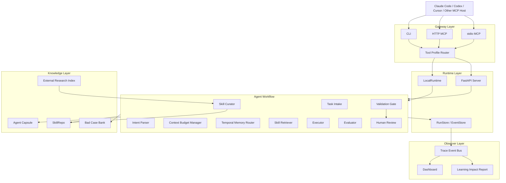

---

## Core Workflow

Each run should follow a traceable workflow:

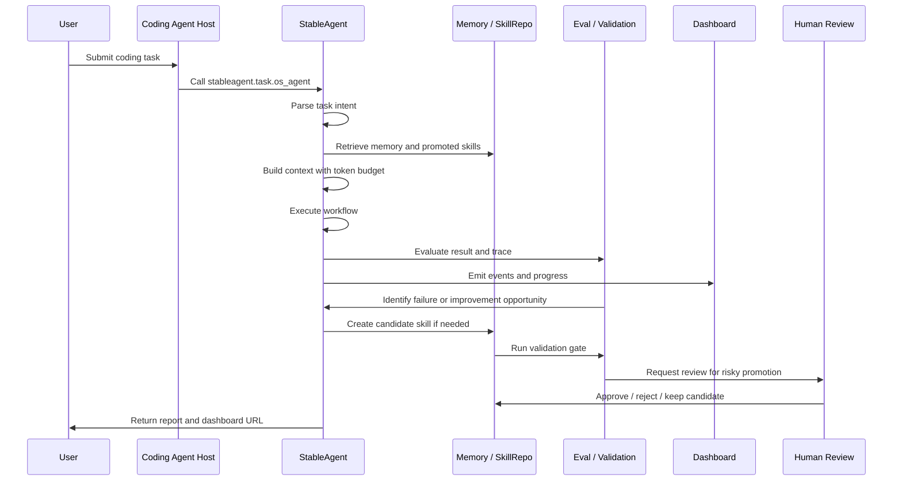

---

## 整体架构

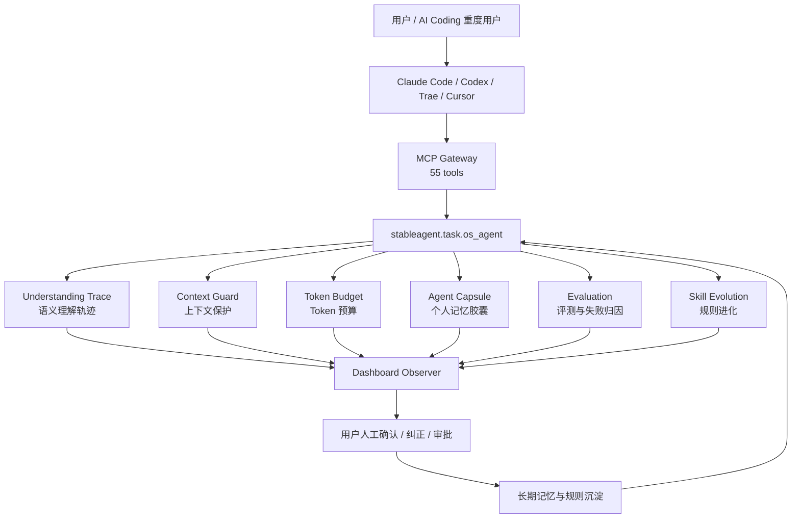

---

## Self-Evolution Loop

StableAgent uses a **bounded self-evolution loop**.

It does not automatically overwrite long-term skills. It should only promote a skill after evidence exists.

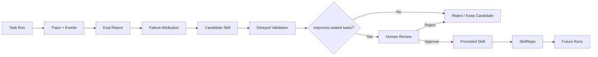

### Promotion rule

A candidate skill should not become a promoted skill unless it satisfies evidence gates such as:

```text
schema_valid = true
validations >= 2
score_delta >= +0.03
regression_count = 0
event_completeness = 1.0
token_delta <= +0.10
high_risk_requires_human_review = true
```

---

## 技能生命周期

StableAgent 使用**有界自我演化闭环**：

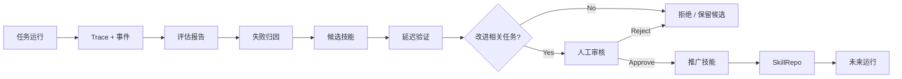

关键原则：

> 失败经验不能直接污染长期规则，必须经过验证和人工审核。

---

## Agent Capsule

The Agent Capsule is the portable personal layer around your AI Coding workflow.

```text
.stableagent-capsule/
├── profile/              # user expression habits and preferences
├── memory/               # long-term memory and project memory
├── skills/               # validated and promoted skills
├── candidates/           # candidate skills waiting for validation
├── bad_cases/            # failure cases and regression examples
├── evals/                # evaluation cases and validation records
├── token_ledger/         # token budget and compression reports
├── model_profiles/       # model-specific strengths and weaknesses
└── effectiveness/        # impact reports and A/B evidence
```

The goal is simple:

> Your AI tools may change, but your preferences, mistakes, rules, and evaluation standards should remain portable.

---

## Agent Capsule：像 U 盘一样带走你的 AI 使用习惯

StableAgent OS 的核心不是一次任务，而是长期积累的 **Agent Capsule**。

它可以理解为：

```text
.stableagent-capsule/
├── profile/              # 你的表达习惯，比如"不要AI味"是什么意思
├── memory/               # 长期记忆、项目记忆、偏好记忆
├── skills/               # 经过验证的工作规则
├── bad_cases/            # 模型犯过的错
├── evals/                # 个人评测样例和回归测试
├── token_ledger/         # Token 使用和节省记录
├── model_profiles/       # 不同模型的能力画像
└── effectiveness/        # 项目有效性 A/B 数据
```

它的目标是：

> 不管你今天用 Claude Code，明天用 Codex，后天换 Trae，你的习惯、错题本、评测标准和任务边界都可以继续迁移。

---

## Visual Task Lifecycle

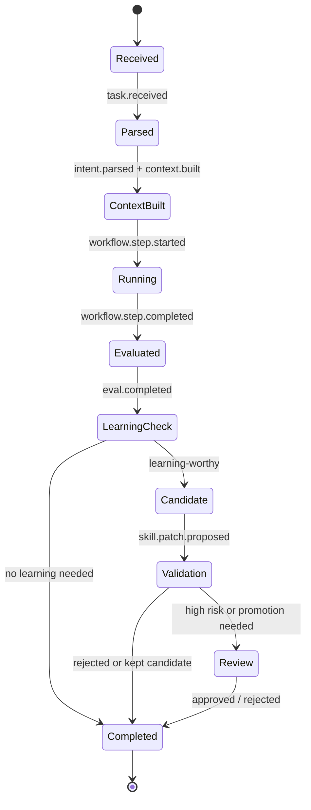

---

## 一次任务在 StableAgent 里如何流动？

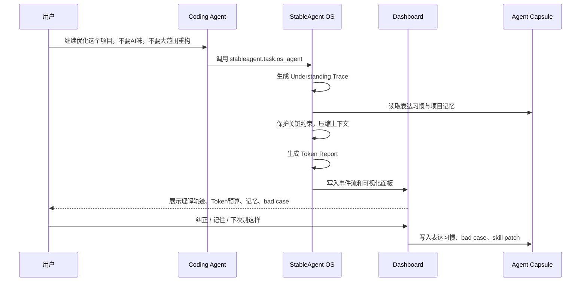

---

## Dashboard Observer

The dashboard should help users understand the Agent instead of only showing logs.

It should answer:

```text
What is the Agent doing now?
Why did it choose this step?
Which memory or skill did it use?
How much context did it keep or drop?
Did the result pass evaluation?
Did this run create a candidate skill?
Does a human need to approve anything?
```

Recommended observer layout:

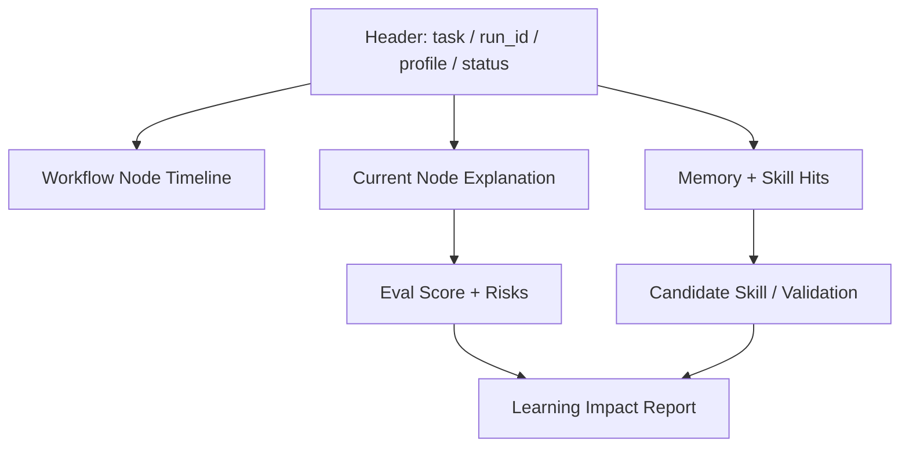

---

## V11 Dashboard：让 Agent 的"脑内过程"可视化

Dashboard 不是普通日志页面，它更像是 Agent 的监控仪表盘。

它会展示：

| 面板 | 作用 |
|---|---|
| Run Trace / 事件时间线 | 这次任务从接收到完成经历了哪些步骤 |
| Understanding Panel | 系统如何理解你的原话，有哪些假设和不确定点 |
| Token Budget | 原本要塞多少上下文，实际保留多少，节省多少 |
| Memory Map | 这次任务用了哪些长期记忆和表达习惯 |
| Bad Case Bank | 出现了哪些失败案例，是否生成回归测试 |
| Skill Evolution | 是否生成新的 Skill Patch，是否进入验证/人工审核 |
| Memory Health | 哪些记忆该保留、合并、删除或人工审核 |

---

## External Research Harness

StableAgent is evolving toward a research-aware harness:

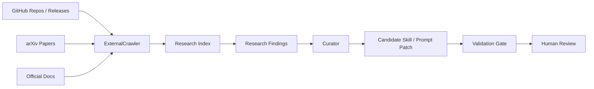

The system should not blindly copy external ideas into long-term memory.

External findings should first become:

- evidence;
- candidate improvement proposals;
- validation cases;
- coding prompts for PR-only implementation.

---

## 外部研究集成

StableAgent 正在向研究感知型 harness 演进：


系统不会盲目复制外部想法到长期记忆。外部发现首先成为：

- 证据
- 候选改进提案
- 验证案例
- 仅用于 PR 实现的编码提示

---

## Current Status

StableAgent OS is currently best described as:

```text
Feature-rich alpha
```

### Already present

- CLI / HTTP MCP / stdio MCP entry points;
- `stableagent.task.os_agent` task execution interface;
- dashboard and observer direction;
- trace events and run lifecycle concepts;
- memory, context budget, token report, feedback, eval, and skill-related modules;
- validation gate and approval specifications;
- tests covering important directions such as delayed validation, dashboard replay, approval, CLI/runtime, and no-fake-improvement constraints.

### Still not mature enough

- true user-perceived personalization is still weak;
- token saving is not yet strongly proven by before/after measurement;
- self-evolution claims still need real benchmark evidence;
- candidate skill validation needs stronger baseline-vs-candidate A/B tests;
- dashboard should show evidence and impact, not just events;
- the harness should remain PR-only and human-reviewed before promotion.

---

## 当前状态

StableAgent OS 当前状态：

```text
Feature-rich alpha
```

### 已实现

- CLI / HTTP MCP / stdio MCP 入口
- `stableagent.task.os_agent` 任务执行接口
- Dashboard 和 Observer 方向
- 追踪事件和运行生命周期概念
- 记忆、上下文预算、Token 报告、反馈、评估和技能相关模块
- 验证门和审批规范
- 测试覆盖：延迟验证、Dashboard 回放、审批、CLI/runtime、无伪造改进约束

### 仍需完善

- 真正的用户感知个性化仍然较弱
- Token 节省尚未通过前后对比测量强力证明
- 自我进化声明仍需要真实基准证据
- 候选技能验证需要更强的基线 vs 候选 A/B 测试
- Dashboard 应展示证据和影响，而不仅仅是事件
- Harness 应在推广前保持 PR-only 和人工审核

---

## Testing

Run the full test suite:

```bash
pytest -q
```

Run selected tests for the core harness direction:

```bash
pytest \
  tests/test_cli_without_http.py \
  tests/test_curator_policy.py \
  tests/test_delayed_validation.py \
  tests/test_delayed_validation_v1.py \
  tests/test_dashboard_history_replay.py \
  tests/test_learning_impact_no_fake_improvement.py \
  -q
```

Run local deployment:

```bash
chmod +x scripts/deploy_local.sh
bash scripts/deploy_local.sh
```

---

## 测试

运行完整测试套件：

```bash
pytest -q
```

运行核心 harness 方向测试：

```bash
pytest \
  tests/test_cli_without_http.py \
  tests/test_curator_policy.py \
  tests/test_delayed_validation.py \
  tests/test_delayed_validation_v1.py \
  tests/test_dashboard_history_replay.py \
  tests/test_learning_impact_no_fake_improvement.py \
  -q
```

---

## Design Principles

### 1. Do not pretend improvement happened

If no memory was hit, no skill was used, or no validation was run, the system should say so clearly.

### 2. Candidate is not promoted

A failed run may create a candidate skill, but that skill should not become long-term behavior without validation.

### 3. Human review remains the final gate

High-risk actions, skill promotion, and codebase-level changes must stay human-reviewed.

### 4. Token savings must be measured

Token optimization should be shown with baseline-vs-actual comparison, not just claimed.

### 5. The dashboard must explain impact

The user should see what changed, what did not improve, and what needs more evidence.

---

## 设计原则

### 1. 不假装改进发生了

如果没有命中记忆、没有使用技能、没有运行验证，系统应该明确说明。

### 2. 候选不自动推广

失败的运行可能创建候选技能，但该技能不应在没有验证的情况下成为长期行为。

### 3. 人工审核仍是最终关卡

高风险操作、技能推广和代码库级别的更改必须保持人工审核。

### 4. Token 节省必须可测量

Token 优化应通过基线 vs 实际对比展示，而不仅仅是声称。

### 5. Dashboard 必须解释影响

用户应该看到什么改变了、什么没有改进、什么需要更多证据。

---

## Roadmap

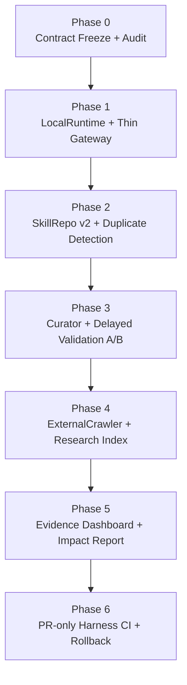

| Phase | Goal | Success Standard |
|---|---|---|
| P0 | Freeze contract and required events | golden snapshots pass |
| P1 | Make gateway thinner and runtime local-first | CLI / stdio work without HTTP dependency |
| P2 | Build real SkillRepo lifecycle | candidate / validated / promoted are separated |
| P3 | Validate skills with related-task A/B | no simulated promotion |
| P4 | Add external research ingestion | GitHub / arXiv findings become evidence, not direct skills |
| P5 | Improve dashboard evidence | user sees memory, skill, token, validation, and impact |
| P6 | Add PR-only harness CI | automation stops at ready-for-human-review |

---

## 项目路线图

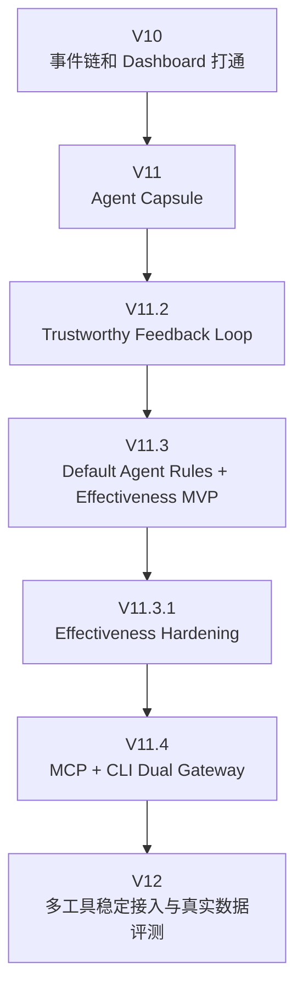

### 下一步重点

- [ ] 修正 Effectiveness schema，加入 `test_passed / rework_count / user_satisfaction` 等完整指标
- [ ] 将 Effectiveness 数据默认写入 `.stableagent-capsule/effectiveness/`
- [ ] 统一 `/api/effectiveness/*` 返回结构
- [ ] Run Observer 增加"记录到 Effectiveness"
- [ ] 积累至少 10 个真实 A/B 任务数据
- [ ] 输出一份真实效果报告

---

## Suggested Portfolio Framing

**Project title**

```text
StableAgent OS｜A Personal Self-Evolving Harness for AI Coding Agents
```

**Short description**

```text
Built a local-first Agent harness that wraps Claude Code / Codex / Cursor with memory routing, context budgeting, trace observability, evaluation, skill curation, validation gates, and human-reviewed self-evolution.
```

**Interview angle**

```text
The project does not claim that the Agent magically becomes smarter.
It turns each Agent run into evidence: what memory was used, what context was protected, what failed, what candidate skill was proposed, and whether later validation proved it useful.
```

---

## 项目背后的核心思想

StableAgent OS 的底层判断是：

> 未来的大模型会越来越强，但每个人真正需要的是"适配自己"的外部使用层。

模型像发动机，StableAgent 像仪表盘、导航、刹车、错题本和驾驶习惯记录器。

发动机升级当然重要，但如果没有稳定的驾驶系统，长任务依然会跑偏。

StableAgent OS 想做的就是这套系统。

---

## Repository Map

```text
OS-Agent/
├── stable_agent/          # core runtime, memory, eval, skill, gateway, approval
├── web/                   # dashboard and observer UI
├── api/                   # API routes and adapters
├── skills/                # skill artifacts and best_skill export
├── experiments/           # self-iteration experiments and reports
├── tests/                 # unit, integration, dashboard, validation, approval tests
├── docs/                  # setup guides and system specifications
├── scripts/               # local deployment and helper scripts
├── requirements.txt
├── pyproject.toml
└── README.md
```

---

## 项目仓库结构

```text
OS-Agent/
├── stable_agent/          # 核心 runtime、记忆、评估、技能、网关、审批
├── web/                   # Dashboard 和 Observer UI
├── api/                   # API 路由和适配器
├── skills/                # 技能工件和 best_skill 导出
├── experiments/           # 自我迭代实验和报告
├── tests/                 # 单元、集成、Dashboard、验证、审批测试
├── docs/                  # 设置指南和系统规范
├── scripts/               # 本地部署和辅助脚本
├── requirements.txt
├── pyproject.toml
└── README.md
```

---

## Safety Boundary

StableAgent OS should evolve as a **bounded self-iteration harness**:

```text
Allowed:
- analyze traces;
- propose candidate skills;
- run validation;
- generate draft patches;
- create reports;
- ask for human approval.

Not allowed by default:
- auto-merge code;
- auto-deploy;
- overwrite best_skill.md without review;
- promote high-risk skills without approval;
- hide failed validation;
- claim learning improvement without evidence.
```

---

## 安全边界

StableAgent OS 应作为**有界自我迭代 harness** 演进：

允许：
- 分析轨迹
- 提出候选技能
- 运行验证
- 生成草案补丁
- 创建报告
- 请求人工批准

默认不允许：
- 自动合并代码
- 自动部署
- 未经审核覆盖 best_skill.md
- 未经批准推广高风险技能
- 隐藏失败的验证
- 在没有证据的情况下声称学习改进

---

## 可视化分析

详细的交互式可视化分析页面：[README_VISUAL.html](README_VISUAL.html)

包含：
- 类比架构（学习装备系统）
- 任务执行流程
- 技能生命周期
- 效果评估指标（A/B 对比雷达图）
- 核心组件详解

---

## 最小有效性实验

想证明 StableAgent 是否真的有用，不要靠感觉，跑 10 个任务：

```text
同类任务 A：直接用 Coding Agent 做。
同类任务 B：先调用 StableAgent，再让 Coding Agent 做。
```

记录：

```json
{
  "task_id": "T01",
  "mode": "baseline | stableagent",
  "success": true,
  "test_passed": true,
  "intent_drift": false,
  "over_editing": false,
  "constraint_preserved": true,
  "rework_count": 1,
  "estimated_tokens": 12000,
  "user_satisfaction": 4
}
```

如果 StableAgent 组出现：

```text
跑偏率下降
返工次数下降
约束保留率上升
bad case 复发率下降
测试通过率不下降
```

才说明它真的有效。

---

## License

This repository is an experimental Agent harness project. Use carefully, keep human review enabled, and treat self-evolution as an evidence-gated engineering workflow rather than an unsupervised autonomous process.

---

<p align="center">
  <strong>StableAgent OS — 让 AI Coding 不只是会做，而是可记忆、可复盘、可验证地越用越懂你。</strong>
</p>
